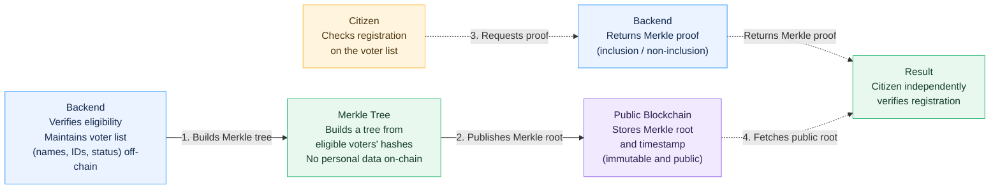

# transparent-voter-list

We have no secrets.

```mermaid
flowchart LR
    B["Backend<br/>Verifies eligibility<br/>Maintains voter list<br/>(names, IDs, status) off-chain"]

    M["Merkle Tree<br/>Builds a tree from<br/>eligible voters' hashes<br/>No personal data on-chain"]

    BC["Public Blockchain<br/>Stores Merkle root<br/>and timestamp<br/>(immutable and public)"]

    C["Citizen<br/>Checks registration<br/>on the voter list"]

    P["Backend<br/>Returns Merkle proof<br/>(inclusion / non-inclusion)"]

    R["Result<br/>Citizen independently<br/>verifies registration"]

    B -->|"1. Builds Merkle tree"| M
    M -->|"2. Publishes Merkle root"| BC
    C -.->|"3. Requests proof"| P
    P -.->|"Returns Merkle proof"| R
    BC -.->|"4. Fetches public root"| R

    classDef backend fill:#EAF3FF,stroke:#3399FF,color:#172B4D
    classDef merkle fill:#E8F8EF,stroke:#2DB875,color:#173D2B
    classDef blockchain fill:#F1EAFE,stroke:#9163E8,color:#302052
    classDef citizen fill:#FFF5DF,stroke:#FFB52E,color:#4D3510
    classDef result fill:#E8F8EF,stroke:#2DB875,color:#173D2B

    class B,P backend
    class M merkle
    class BC blockchain
    class C citizen
    class R result
```
